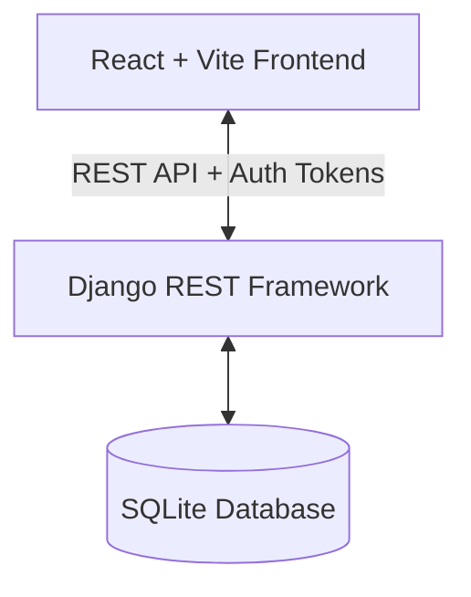

# 🏥 MediSync — Role-Based Hospital Management System

MediSync is a state-of-the-art, secure, and beautiful Hospital Management System. It features a fully responsive React + Vite frontend styled with sleek custom modern CSS, and a robust Django REST Framework backend implementing strict Role-Based Access Control (RBAC).

---

## 🌟 Key Features

### 👤 Role-Based Portals & Dashboards
- **Admin Dashboard**: Comprehensive command center to manage departments, monitor appointments, track billing, oversee doctor/patient records, and view user feedback.
- **Doctor Dashboard**: Manage patient queues, update appointment statuses, view patient medical history, and issue detailed digital prescriptions.
- **Patient Dashboard**: Book/view appointments in real-time, view live wait times in the queue, check prescription history, access medical billing, and leave feedback for doctors.

### ⏱️ Smart Queue Management
- Real-time queue positioning with dynamically calculated estimated wait times for patients awaiting their appointment.

### 💊 Electronic Prescriptions & Billing Integration
- Complete prescription issuance including dosage details (e.g., `1-0-1`) and quantity.
- Automatic billing engine that dynamically calculates prescription costs alongside doctor consultation fees.
- Instant invoice generation with `PAID` or `UNPAID` status tracking.

### 📦 Medicine Inventory Tracking
- Centralized pharmacy inventory system monitoring unit pricing, stock levels, and automatic warnings for out-of-stock items.

---

## 🏗️ Architecture & Technology Stack



- **Frontend**: React 18, Vite, Context API for state/auth management, modern CSS with HSL-tailored variables, responsive layout.
- **Backend**: Django, Django REST Framework (DRF), custom Token Authentication, custom RBAC permissions.
- **Database**: SQLite3.

---

## 📁 Repository Structure

```text
medisync/
├── medisync_backend/       # Django REST Framework Backend
│   ├── hospital/           # Main application logic (Models, Views, Serializers)
│   ├── medisync_backend/   # Project configuration & settings
│   ├── seed_db.py          # Data seeding script
│   └── create_users.py     # User authentication generation script
├── medisync_frontend/      # React + Vite Frontend
│   ├── src/
│   │   ├── components/     # Reusable layout, sidebar, & protected routes
│   │   ├── context/        # Authentication and global states
│   │   ├── pages/          # Dashboard, Appointments, Billing, Inventory, etc.
│   │   └── services/       # Axios API integrations
├── README.md               # Documentation
└── report.docx             # Project report & documentation
```

---

## 🚀 Setup & Execution Guide

### Prerequisites
Make sure you have the following installed:
- **Python 3.8+**
- **Node.js 16+** & **npm**

---

### 1. Backend Setup (Django)

Open your terminal and navigate to the backend folder:

```powershell
# Navigate to the backend directory
cd medisync_backend

# Activate the virtual environment
.\venv\Scripts\Activate.ps1

# Install requirements (if modifying dependencies)
# pip install -r requirements.txt

# Apply migrations
python manage.py makemigrations
python manage.py migrate

# (Optional) Seed the database with sample data
python seed_db.py
python create_users.py

# Start the Django development server
python manage.py runserver 8000
```
*The backend server will run at: **http://127.0.0.1:8000/**.*

---

### 2. Frontend Setup (React + Vite)

Open a **second** terminal and navigate to the frontend folder:

```powershell
# Navigate to the frontend directory
cd medisync_frontend

# Install node dependencies
npm install

# Start the Vite local development server
npm run dev -- --port 5173
```
*The frontend application will start at: **http://localhost:5173/**.*

---

## 🔐 Credentials for Demo Accounts

For ease of testing, the system provides pre-configured role accounts. You can log in using these or click their quick-fill buttons on the login screen:

| Role | Username | Password | Purpose |
| :--- | :--- | :--- | :--- |
| **Admin** | `admin` | `admin123` | Control panel, doctors, billing and reports |
| **Doctor** | `sarah.j` | `doctorpassword` | View patient queue, write prescriptions |
| **Patient** | `maria.garcia` | `patientpassword` | Book appointments, view invoices & feedback |

---

## 🛠️ Contribution & Development
When contributing or pushing changes, please ensure that:
1. All local SQLite database files (`db.sqlite3`) and node modules are kept ignored.
2. Sensible error handling is used on frontend Axios requests.
3. No hardcoded absolute local paths are committed. Use dynamic paths relative to the script file.
